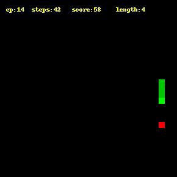

# Snake AI

[ [English](README.md) ]

強化学習について学ぶために取り組んだ個人的なミニプロジェクトです。（友達に共有するために公開レポにしました。）エージェントは Deep Q Network を使って状況に応じて最適の動作をとります。このエージェントの訓練には比較的単純な手法を用いていて、ターゲットネットワークなどは使っていません。この点に関しては今後改善していきたいと思っています。

## ファイル

各ファイルのざっとした説明

| ファイル名 | 役割                                                                                           |
| ---------- | ---------------------------------------------------------------------------------------------- |
| agent.py   | エージェントと DQN を含んでいる。                                                              |
| demo.py    | 訓練済みのネットワークでデモ動画を作成する。 (demo.mp4)                                        |
| game.py    | ゲームを含む (SnakeGame)                                                                       |
| train.py   | 訓練に用いる。ハイパーパラメータはファイルに直接書き込んで編集する必要がある。(あとで修正する) |
| utils.py   | 動画作成やプロット作図などのための関数を含んだユーティリティファイル                           |
| video.py   | video.py とは別の動画作成関数。開始フレームと終了フレームが選べる。 (WIP)                      |

## メモ

- requirements.txt には不必要なライブラリも含まれている。（複数プロジェクトに包括的に対応する環境の下で pip freeze を行ったため。）

- スネークのスコアは 3000 エピソードあたりでプラトーし始める。

- スネークは稀に自身の体に衝突する。りんごが体の反対側に現れた時などは特にこうなりやすい。← この状況がリプレイメモリ内に不足していることが原因だと思われる。この状況は 200~500 ステップに一度発生する程度のもので、長さ 100,000 のメモリ内に 200〜500 件しか存在しない計算になる。（3000 エピソードあたりでプラトーし始めるのもこれが原因かもしれない。）

## 参考文献

個人的なプロジェクトなのでどのコードのどの行が誰によって書かれたものなのかは具体的には説明しない。簡単に言うと、スネークゲームは完全に自作、エージェントと DQN は(1)のコードを元に改造したもの、報酬設計は(2)のそれを使用した。

1. _Deep Q Learning is Simple with PyTorch | Full Tutorial 2020_, Machine Leanring with Phil, 2020, https://www.youtube.com/watch?v=wc-FxNENg9U&ab_channel=MachineLearningwithPhil

2. _Snake Played by a Deep Reinforcement Learning Agent_, Harder D. H., 2020, https://towardsdatascience.com/snake-played-by-a-deep-reinforcement-learning-agent-53f2c4331d36
