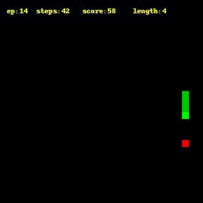

# Snake AI

This is a small project I worked on to learn more about reinforcement learning. The agent uses a Deep Q Network to find the optimal action given a state. Note that this agent uses as simple learning method, and does not have a target network. I look to improve on this in the future.

## Files

A quick explanation of what each file does.

| Filename | purpose                                                                                         |
| -------- | ----------------------------------------------------------------------------------------------- |
| agent.py | contains the agent and the DQN                                                                  |
| demo.py  | uses a pre-trained network to create a demo video (demo.mp4)                                    |
| game.py  | contains the game (SnakeGame)                                                                   |
| train.py | used for training. Hyperparameters must be edited via the file. (will fix later)                |
| utils.py | contains utility functions for creating plots and videso                                        |
| video.py | seperate video function with the ability to choose which frames to begin from and end at. (WIP) |

## Notes

- requirements.txt contains unnecessary dependencies. (since this was made with pip freeze on a large environment that was meant to emcompass some of my other personal projects)

- snake's score seems to plateu at around 3,000 episodes.

- snake has a habit of occasionally running into itself, especially when the apple spawns in the opposite direction, or the snake is facing a wall

## References

Since this is a personal project I won't be going in to the details of which exact lines of code were taken from whom. Simply put, the snake game was coded by me; the DQN and Agent classes were mostly adapted upon the code from (1); the environment rewards were taken from (2).

1. _Deep Q Learning is Simple with PyTorch | Full Tutorial 2020_, Machine Leanring with Phil, 2020, https://www.youtube.com/watch?v=wc-FxNENg9U&ab_channel=MachineLearningwithPhil

2. _Snake Played by a Deep Reinforcement Learning Agent_, Harder D. H., 2020, https://towardsdatascience.com/snake-played-by-a-deep-reinforcement-learning-agent-53f2c4331d36
